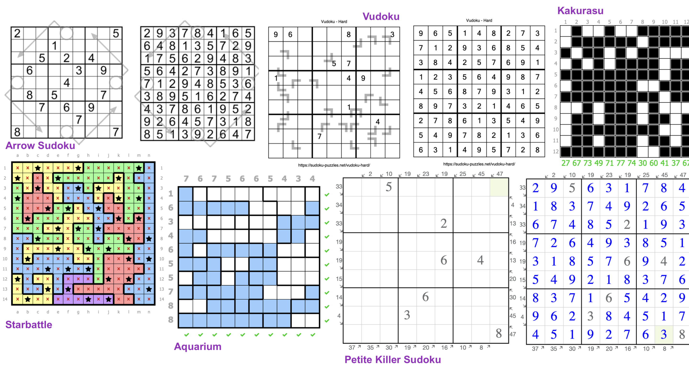
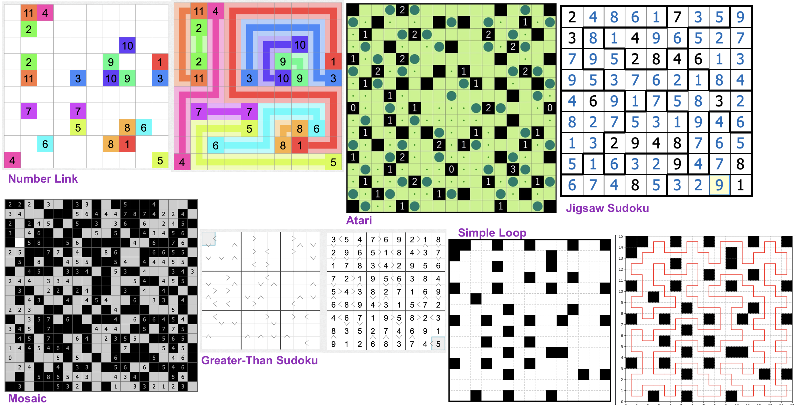

# Puzzles Solvers & OR tutorials

This repo provides useful solvers of some interesting puzzles. Some basic demos of classic OR problems are also included. The main solver I used in the repo is Google Operations Research software [ORtools](https://developers.google.cn/optimization?hl=zh-cn), especially its CS-SAT solver. Commercial solver Gurobi (Licence required, of course) is also used for specific puzzle(Like Slitherlink). 

Since most present solver of those problems are based on logical methods, this repo provides solvers based on mathematical Programming (Integer Programming, Constraint Programming etc..)

Take it slowly, it'll go fast.

✅ Python Environment: Python 3.10.12, 

✅ Gurobi Optimizer Version: 10.0.3.

✅ ortools Optimizer Version: 9.7.2996

## Catalog

-------

1. [Ortools for diversified Sudoku-like Puzzles](./Puzzles.ipynb): 🥰 The very beginning of my repo. In this note, most of the sudokus (and variants) are well-designed so <u>you can easily add or delete or integrate these constraints</u> and solve comprehensive Sudoku grid, such as **"Killer sudoku with Thermo Constraints"** or **"Anti-Knight Diagnoal Sudoku"**. A very good example is [This](https://cn.gridpuzzle.com/sudoku-puzzles?page=3). 

2. [**Solvers for Logic Puzzles using CS-SAT or MILP**](./Puzzles/). More INTERESTING and brain-burned logic puzzles. Including path-finding, digit-filling and flag-placing puzzles. The puzzles that have been solved:

|  ID   |                  English Name of Puzzles                  | Chinese Translation | Finished? |                             Note                             |
| :---: | :-------------------------------------------------------: | :-----------------: | :-------: | :----------------------------------------------------------: |
|   1   |                     A Standard Sudoku                     |      标准数独       |     ✅     |                                                              |
|   2   |        [An Alphadoku](./Puzzles/Alphabetoku.ipynb)        |   25 by 25 字母独   |     ✅     |                                                              |
|   3   |                      A Killer Sudoku                      |      杀手数独       |     ✅     |                                                              |
|   4   |                  A petite Killer Sudoku                   |     小杀手数独      |     ✅     |                                                              |
|   5   |                   A Consecutive Sudoku                    |      连续数独       |     ✅     |                                                              |
|   6   |                     A Sandwich Sudoku                     |     三明治数独      |     ✅     |                                                              |
|   7   |      [Akari](./Puzzles/Akari.ipynb) (aka: light UP!)      |        照明         |     ✅     |           [Rules](https://www.puzzle-light-up.com)           |
|   8   | [Cryptarithmetic Puzzle](./Puzzles/Cryptarithmetic.ipynb) |      破译密码       |     ✅     |                                                              |
|   9   |           [Norinori](./Puzzles/NoriNori.ipynb)            |        海苔         |     ✅     |           [Rules](https://www.puzzle-norinori.com)           |  |
|  10   |                   A thermometer Sudoku                    |     温度计数独      |     ✅     |                                                              |
|  11   |         [Number Link](./Puzzles/NumberLink.ipynb)         |        数链         |     ✅     |                                                              |
|  12   |       [A Minesweeper](./Puzzles/Minesweeper.ipynb)        |      静态扫雷       |     ✅     |                                                              |
|  13   |  [Simple Loop](./Puzzles/SimpleLoop.ipynb) (AKA: Loopy~)  |      简单回路       |     ✅     |                    🚀 Gurobi used for MILP                    |  |
|  14   |        [Siltherlink](./Puzzles/SlitherLink.ipynb)         |         环          |     ✅     |                    🚀 Gurobi used for MILP                    |  |
|  15   |                       Jigsaw Sudoku                       |      锯齿数独       |     ✅     |                                                              |
|  16   |                    Anti-Knight Sudoku                     |      无马数独       |     ✅     |                                                              |
|  17   |                     Anti-King Sudoku                      |      无缘数独       |     ✅     |                                                              |
|  18   |                    Black-White Sudoku                     |     黑白点数独      |     ❌     |                                                              |
|  19   |                       Arrow Sudoku                        |      箭头数独       |     ✅     |                                                              |
|  20   |             [Mosaic](./Puzzles/Mosaic.ipynb)              |       马赛克        |     ✅     | [Rules](https://www.puzzle-minesweeper.com/mosaic-5x5-easy/) |
|  21   |                    Greater Than Sudoku                    |     不等式数独      |     ✅     |                                                              |
|  22   |               [Tent](./Puzzles/Tent.ipynb)                |        帐篷         |     ✅     |            [Rules](https://www.puzzle-tents.com)             |
|  23   |           [Nonogram](./Puzzles/Nonogram.ipynb)            |        数织         |     ✅     |                      No use of ortools                       |
|  24   |            [Aquaium](./Puzzles/Aquarium.ipynb)            |        水箱         |     ✅     |                                                              |
|  25   |           [Kakurasu](./Puzzles/Kakurasu.ipynb)            |       方阵和        |     ✅     |                                                              |
|  26   |         [Starbattle](./Puzzles/Starbattle.ipynb)          |        星战         |     ✅     |                                                              |
|  27   |                 [Vudoku](./Puzzles.ipynb)                 |       V宫数独       |     ✅     |       [Rules](https://sudoku-puzzles.net/vudoku-hard/)       |
|  28   |                         3D-Sudoku                         |      三维数独       |     🚀     |                                                              |
|  29   |                           LITS                            |        LITS         |     🐌     |                                                              |
|  30   |          [Pentomino](./Puzzles/Pentomino.ipynb)           |      五联骨牌       |     ✅     |         [Rules](https://isomerdesign.com/Pentomino/)         |
|  31   |             [Suguru](./Puzzles/Suguru.ipynb)              |          🤔️          |     ✅     |    [Rules](https://puzzlegenius.org/suguru-from-scratch/)    |
|  32   |            [Shikaku](./Puzzles/Shikaku.ipynb)             |        直角         |     🐌     |       [Rules](https://www.puzzle-shikaku.com/?size=5)        |
|  33   |             [Kakuro](./Puzzles/Kakuro.ipynb)              |       交叉和        |     ✅     |                                                              |
|  34   |            [Binario](./Puzzles/Binario.ipynb)             |       二进制        |     ✅     |                                                              |
|  35   | [Five Cells(aka: Faibuseruzu)](./Puzzles/FiveCells.ipynb) |       五空格        |     ✅     |                                                              |
|  36   |   [Fobidoshi (aka: No Four)](./Puzzles/Fobidoshi.ipynb)   |      禁止四联       |     ❌     |                                                              |
|  37   |             [Hitori](./Puzzles/Hitori.ipynb)              |      请勿打扰       |     ✅     |                    🚀 Gurobi used for MILP                    |
|  38   |           [Monotone](./Puzzles/Monotone.ipynb)            |       单调性        |     ✅     |                    🚀 Gurobi used for MILP                    |
|  39   |           [Creek](./Puzzles/Creek.ipynb)            |       小溪        |     ✅     |                    🚀 Gurobi used for MILP                    |

-----

Some materials for self-learning:

1. [Ortools for Linear Programming](./SimpleLP.ipynb) : Tutorials.
2. [Ortools for Mixed Integer Programming](./IntegerOpt.ipynb): Tutorials.
3. [Ortools for Constraint Programming](./ConstraintOpt.ipynb): Tutorials.
4. [Ortools for Knapsack Problem](./KnapsackPro.ipynb): Tutorials.

5. [Ortools for VRP](./VRP): Variants and ortools codes( of official website for self-learning).
6. [Ortools & Gurobi for TSP](./TSP.ipynb): Two main methods for TSP. 

> For text explanation and mathematical Modeling, visit [My Website](https://smilingwayne.github.io/me/Study/OR/TSP/) for more info.

7. [Column Generation Method: Large-Scale Linear Programming and Cutting Stock Problems](./Techniques/ColGen/CSP.ipynb): Team Meeting report.

8. Branch & Price for Parallel Machine Scheduling: 🐌...

-------

1. Some basic / classic [Operations Research Modeling](./modeling/) :

## Ref:

- [ORtools Official](https://developers.google.cn/optimization?hl=zh-cn)
- [Hakank's ORtools tutorials](http://www.hakank.org/google_or_tools/)
- Puzzle data: [Raetsel's Janko](https://www.janko.at/Raetsel/index.htm), [Puzzle](https://www.puzzle-loop.com)
